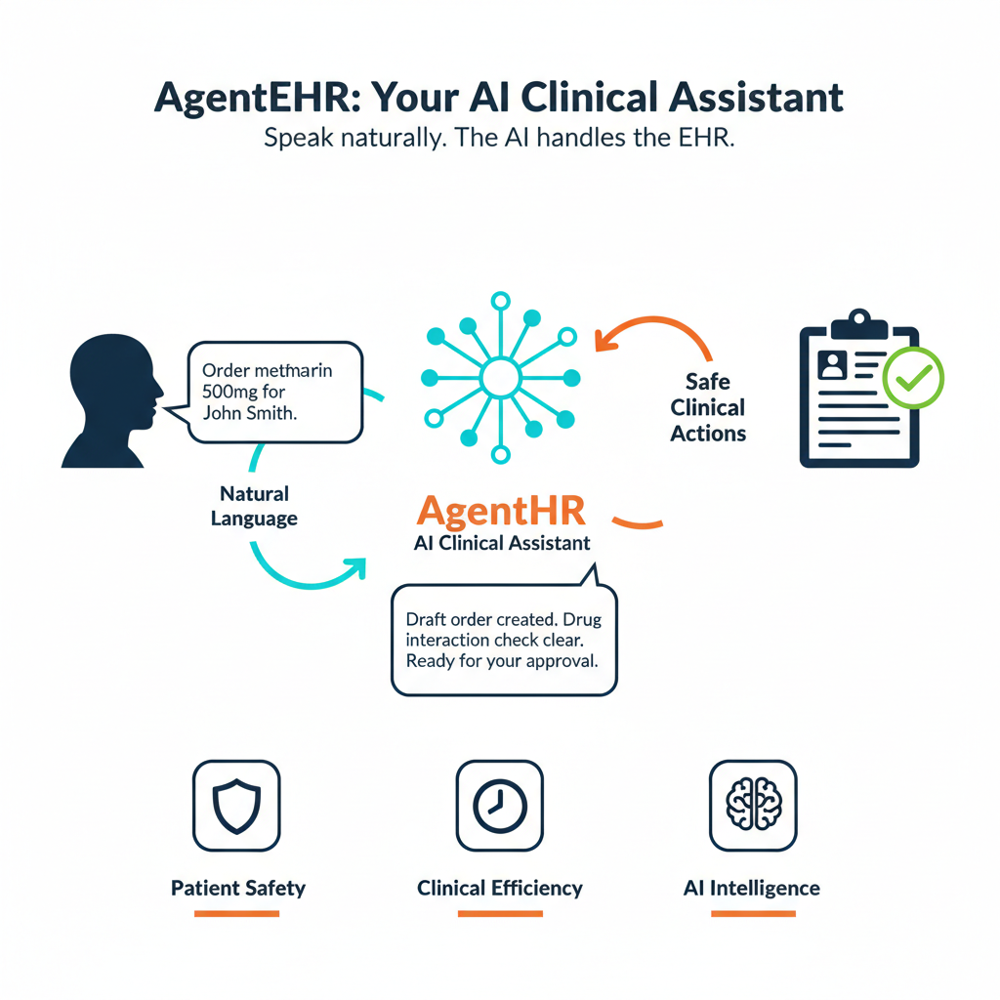
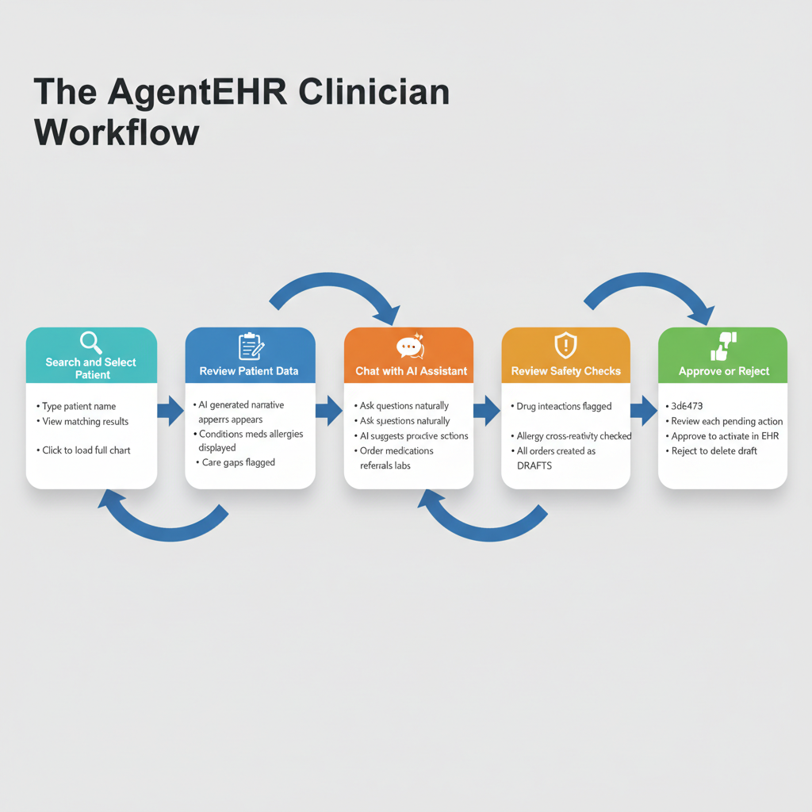
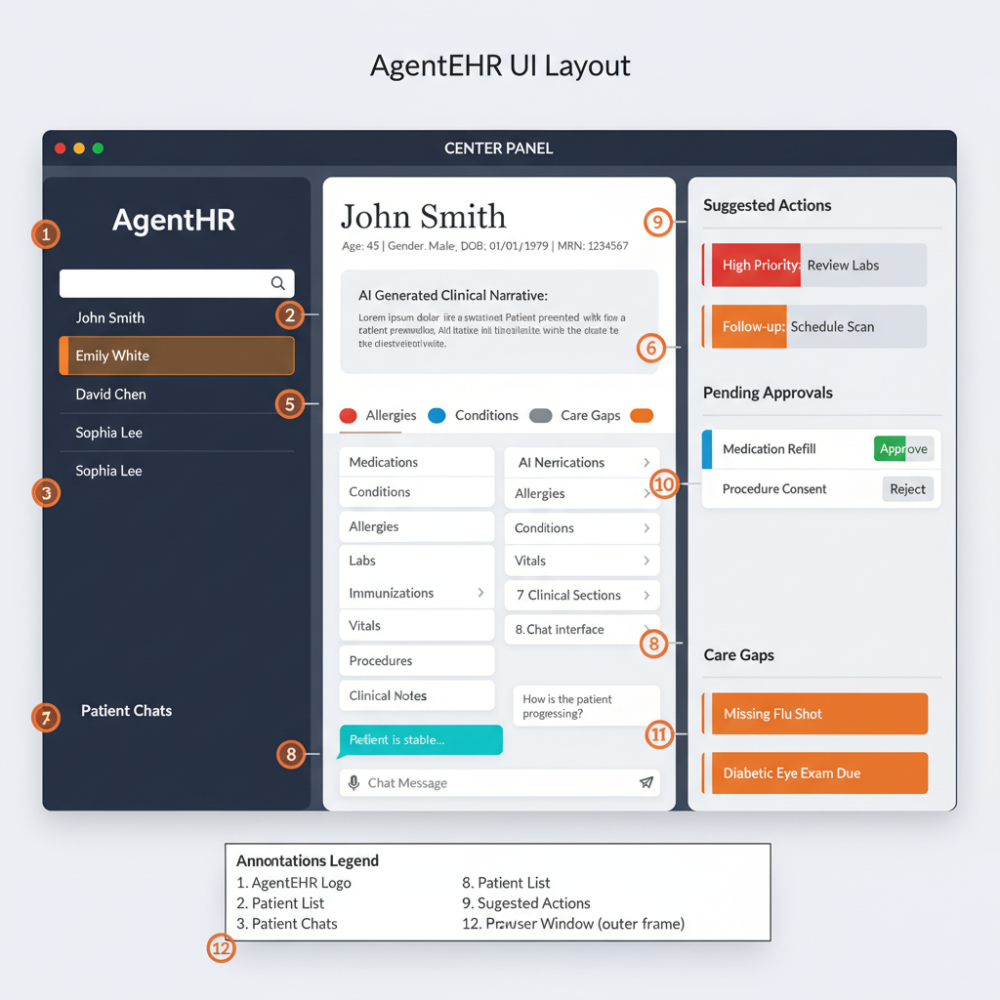
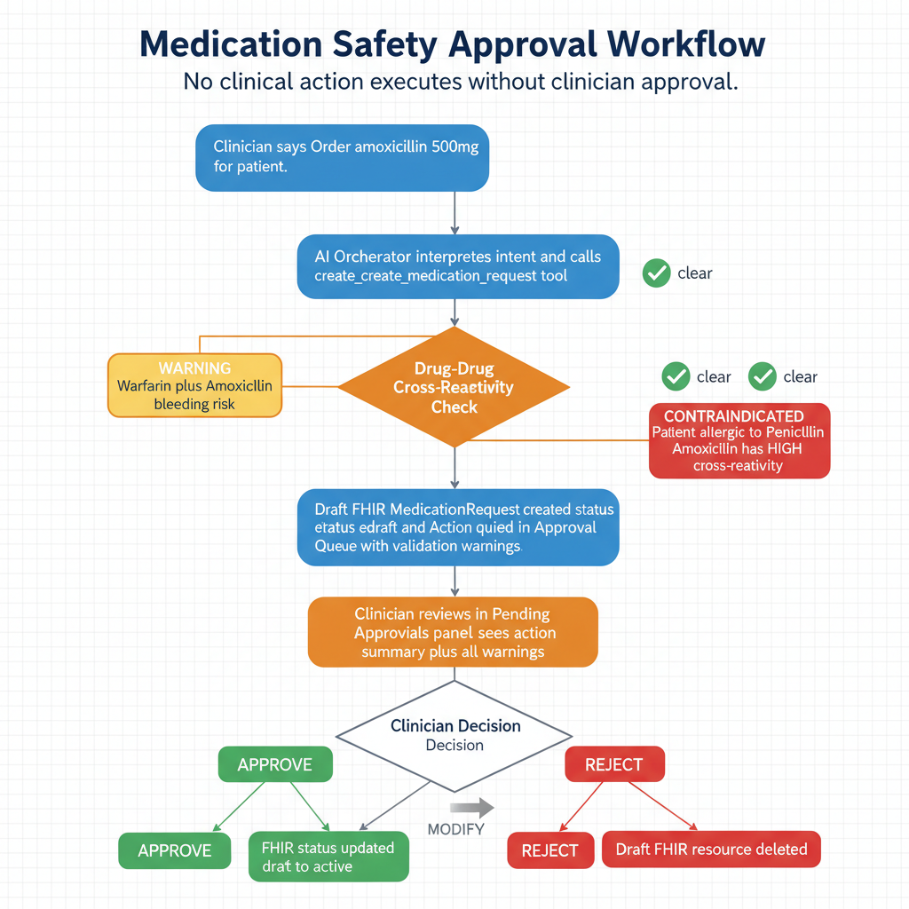
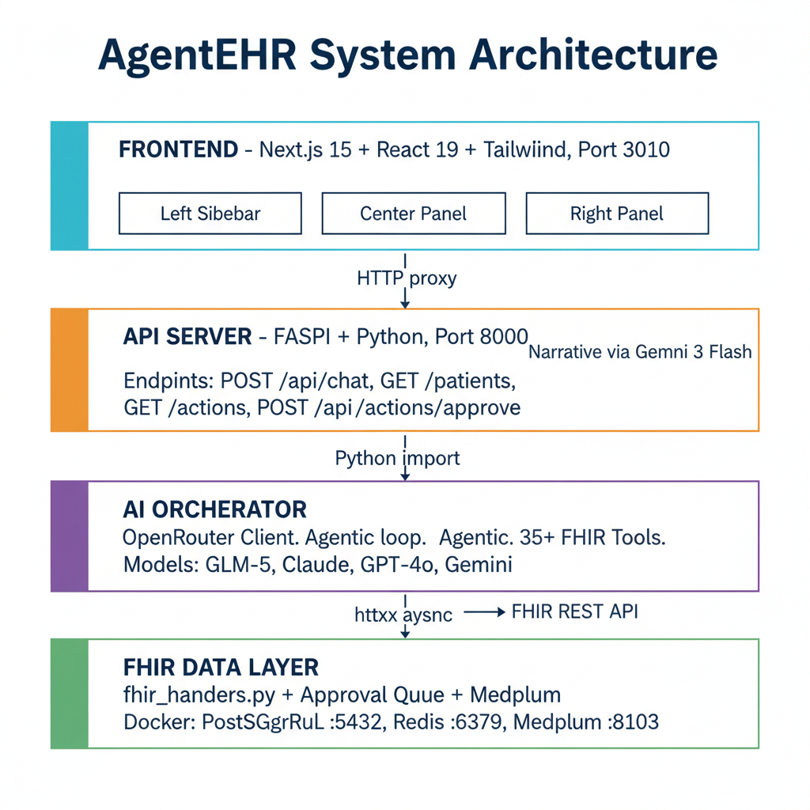
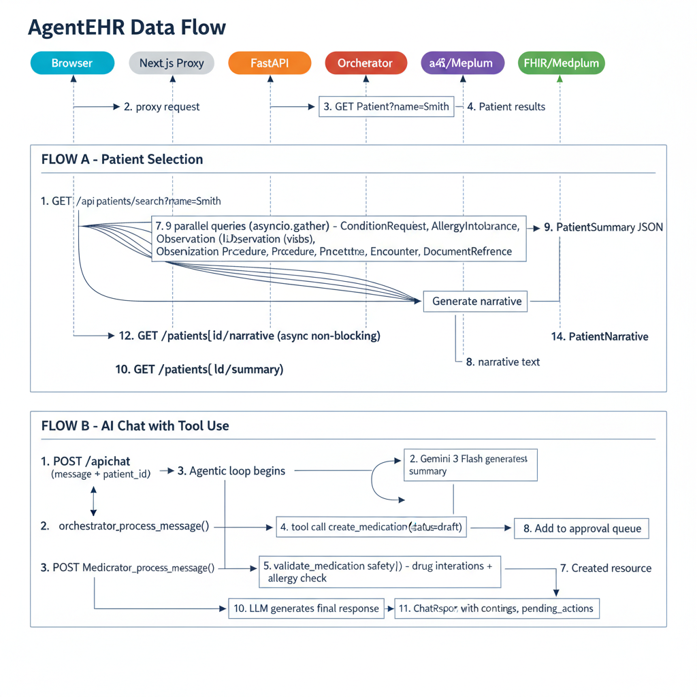
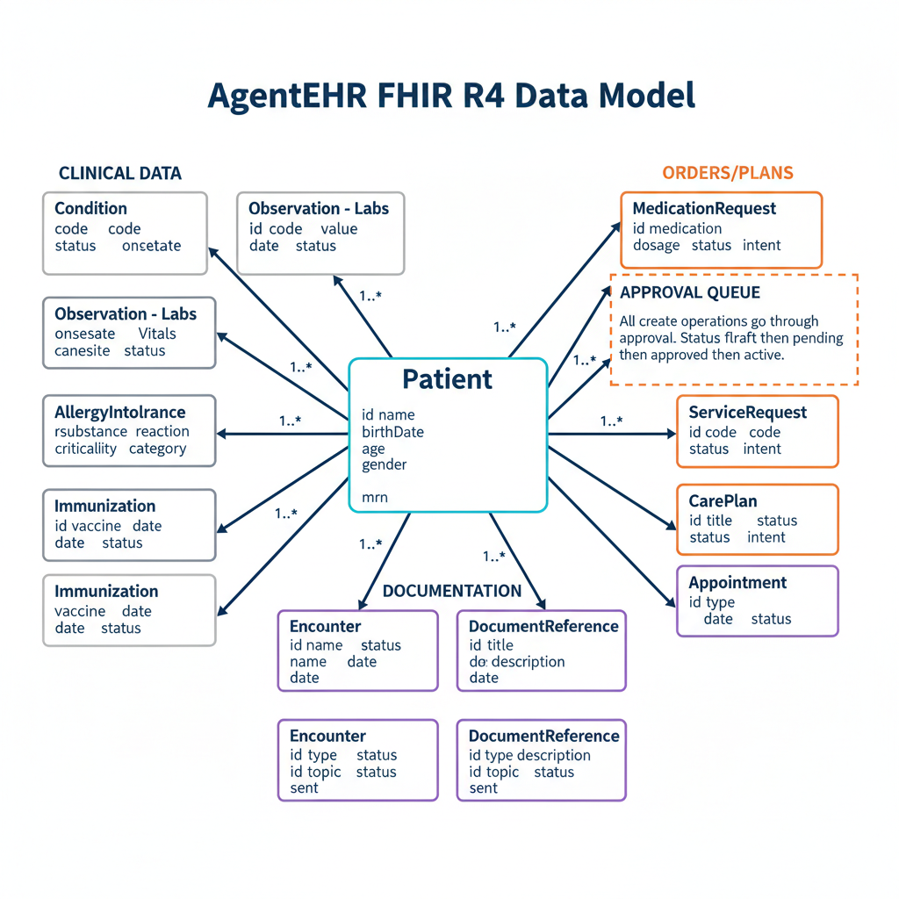
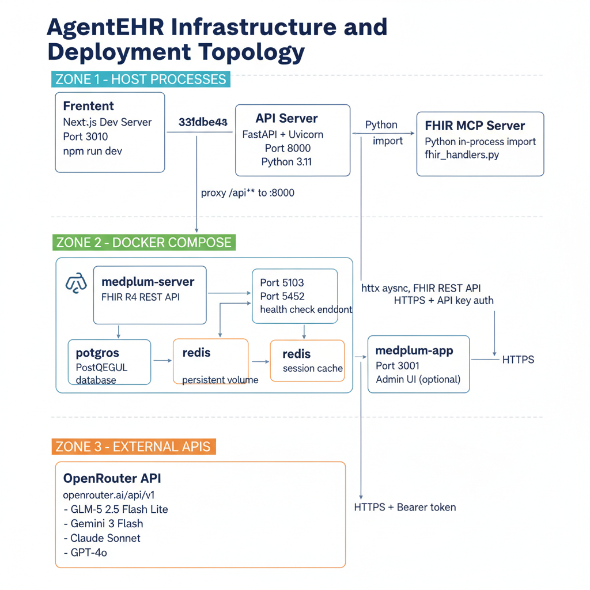

# AgentEHR: How It Works

## The Problem

Electronic Health Records were supposed to make medicine better. Instead, they made it slower. Clinicians spend more time clicking through nested menus, copying lab values between screens, and wrestling with order entry forms than they spend talking to patients. The average physician logs over two hours of after-hours EHR work every day. The tools meant to help them have become the obstacle.

AgentEHR starts from a different premise: what if clinicians could simply say what they need, and an AI assistant handled the rest?

The concept is straightforward. A clinician speaks or types a natural-language instruction — "Order metformin 500mg twice daily for John Smith" — and AgentEHR interprets the intent, validates the safety, drafts the order, and presents it for approval. The AI handles the EHR. The clinician stays focused on the patient.

---

## A Day in the Clinic

Dr. Patel has a full afternoon schedule. Her next patient is John Smith, a 56-year-old man here for a diabetes follow-up. She opens AgentEHR, types "John Smith" into the search bar, and selects him from the results. In under four seconds, the system assembles everything she needs: conditions, medications, allergies, recent labs, vitals, immunizations, procedures, and clinical notes. An AI-generated narrative summarizes the patient's story in plain clinical language. Care gaps — a missed diabetic eye exam, an overdue flu vaccine — are flagged automatically before she even asks.

This five-step workflow — search, review, chat, safety check, approve — is the backbone of every AgentEHR session. The clinician never leaves the interface. Every action flows through the same predictable loop, ending with an explicit human decision.

---

## One Screen, Three Panels

The interface is designed around a three-panel layout that puts the full clinical picture in a single view.

On the left, a dark sidebar lists patient threads — ongoing conversations organized by patient, with unread counts and timestamps. Dr. Patel can switch between patients without losing context. The center panel is the clinical workspace: patient demographics at the top, the AI-generated narrative below, then status pills summarizing allergies, medications, active conditions, and care gaps at a glance. Beneath that, collapsible sections hold the full clinical record — labs with trends, vitals, immunizations, procedures, encounter history, and notes. At the bottom, a chat interface lets Dr. Patel converse with the AI in natural language. On the right panel, suggested actions appear with priority borders, pending approvals wait with approve and reject buttons, and care gap cards highlight what's missing. Everything a clinician needs, without switching tabs or screens.

---

## Conversational Care — With Safety Rails

Dr. Patel reviews John Smith's A1C: 7.2%, up from 6.8% six months ago. She types: "Order metformin 500mg twice daily."

The AI interprets her intent and begins working. It identifies the patient, pulls his current medication list, and runs the new order through two layers of validation. First, a drug-drug interaction check scans his active medications against 15+ built-in interaction rules — warfarin and NSAIDs, ACE inhibitors and potassium, metformin and contrast agents. Second, an allergy cross-reactivity check compares the new drug against his documented allergies, catching cross-reactions like penicillin-cephalosporin sensitivity.

If either check raises a flag, warnings are attached to the order. But critically, the order is never auto-executed. It is created as a FHIR draft and placed in the approval queue. Dr. Patel sees it in the right panel with any warnings displayed. She reviews, then clicks Approve to activate the order — or Reject to delete it. No clinical action in AgentEHR executes without explicit clinician approval. This is a foundational design principle, not a feature toggle.

---

## Under the Hood

Behind the conversational interface is a four-layer architecture.

The **frontend** is a Next.js 15 application with React 19 and Tailwind CSS, serving the three-panel interface on port 3010. It proxies all API calls through Next.js rewrites to the backend. The **API server** is a FastAPI application on port 8000 that manages conversations, serves patient summaries, generates AI narratives via Gemini 3 Flash, and handles the approval queue endpoints. The **AI orchestrator** is the intelligent core — an OpenRouter client that runs an agentic loop: it sends the clinician's message to a large language model, receives tool call requests, executes them against 35+ FHIR tools, and loops until the model produces a final response. It is model-agnostic by design, supporting GLM-5, Claude, GPT-4o, and Gemini through a single interface. The **FHIR data layer** provides the clinical data foundation — a Medplum FHIR R4 server backed by PostgreSQL and Redis, running in Docker containers.

---

## Data in Motion

When Dr. Patel selects John Smith, a precise choreography of data fetches begins.

The browser sends a summary request through the Next.js proxy to FastAPI, which fires nine parallel FHIR queries simultaneously — conditions, medications, allergies, labs, vitals, immunizations, procedures, encounters, and clinical notes — using Python's `asyncio.gather`. The results are assembled into a single PatientSummary response and returned to the browser. In parallel, a separate non-blocking request triggers narrative generation: the patient's clinical data is sent to Gemini 3 Flash, which produces a natural-language summary that streams into the UI as it completes.

When Dr. Patel sends a chat message, the flow is different. Her message is posted to FastAPI, which routes it to the orchestrator. The orchestrator enters its agentic loop: the LLM reasons about the request, emits tool calls (search patient, check medications, create order), the system executes each tool against the FHIR server, feeds the results back, and the LLM generates its final response — complete with any warnings and pending actions.

---

## The Data Foundation

All clinical data in AgentEHR is stored and exchanged using FHIR R4, the international standard for healthcare interoperability.

The Patient resource sits at the center. Radiating outward are three groups: **clinical data** (Condition, Observation for labs and vitals, AllergyIntolerance, Immunization, Procedure), **orders and plans** (MedicationRequest, ServiceRequest, CarePlan, Appointment), and **documentation** (Encounter, DocumentReference, Communication). Every order-type resource passes through the approval queue. The lifecycle is always the same: a resource is created with status `draft`, queued for clinician review, and only transitions to `active` upon explicit approval. Rejected drafts are deleted entirely.

---

## Infrastructure and What Comes Next

AgentEHR runs across three zones. Host processes — the Next.js frontend, FastAPI server, and FHIR tool handlers — run natively on the developer's machine. The Medplum stack — the FHIR server, PostgreSQL, and Redis — runs in Docker Compose containers with health checks and dependency management. External API calls go to OpenRouter for LLM inference, authenticated via API key over HTTPS.

This topology is designed for local development today and cloud deployment tomorrow. The Docker containers can move to Kubernetes. The host processes can become container images. The external API layer is already cloud-native.

But across every layer, one principle holds: **the clinician stays in control**. AgentEHR is not an autonomous system. It is an assistant — fast, knowledgeable, and tireless — that proposes and the physician disposes. Every order is a draft until a human says otherwise. That is the contract at the heart of the system, and it runs from the UI buttons all the way down to the FHIR resource status codes.
